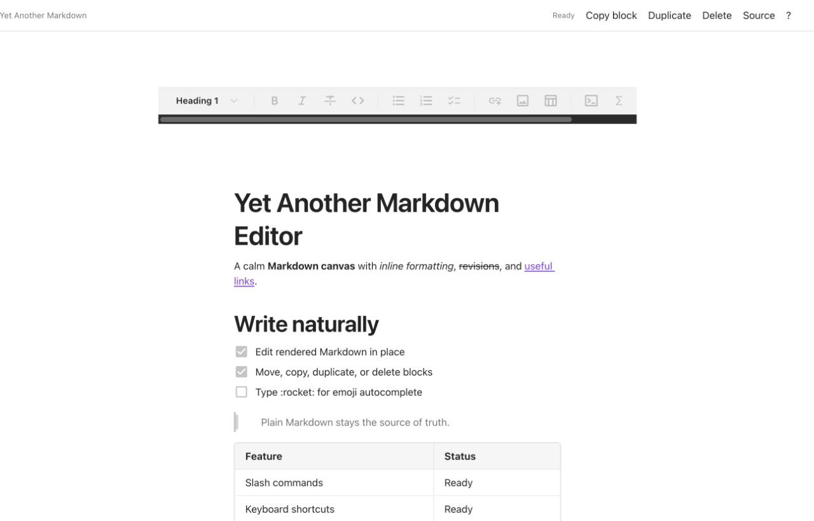
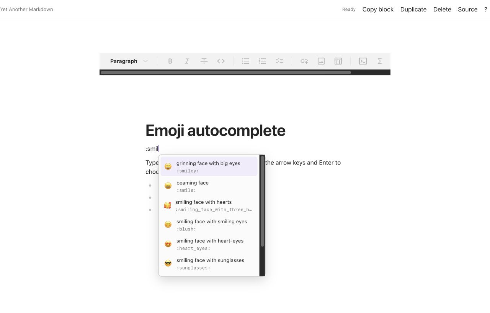

<p align="center">
  
</p>

# Yet Another Markdown Editor

<p align="center">
  A fast, block-oriented WYSIWYG Markdown editor for Visual Studio Code.<br>
  Write like a document editor. Keep portable <code>.md</code> files.
</p>

<p align="center">
  <a href="https://github.com/akiyamasho/yet-another-markdown-editor/releases/latest"></a>
  <a href="https://github.com/akiyamasho/yet-another-markdown-editor/releases/latest/download/yet-another-markdown-editor.vsix"></a>
  <a href="LICENSE"></a>
</p>

> Not published to the VS Code Marketplace yet. Install the release artifact from GitHub: **[download the latest VSIX](https://github.com/akiyamasho/yet-another-markdown-editor/releases/latest/download/yet-another-markdown-editor.vsix)** or read the **[latest release notes](https://github.com/akiyamasho/yet-another-markdown-editor/releases/latest)**.

## Edit rendered Markdown directly

Open a `.md` or `.markdown` file and work in a calm document canvas. Markdown remains the source of truth, with VS Code save, undo, revert, and external-edit behavior preserved.



## Features

- Headings, paragraphs, bold, italic, strikethrough, links, images, quotes, dividers, lists, task lists, tables, inline code, fenced code, math, and GFM content.
- Selection formatting toolbar plus a persistent, horizontally scrollable top toolbar.
- `/` commands and add/drag block handles.
- Whole-block copy as Markdown, duplicate, and delete actions with undo support.
- Fast cross-platform emoji completion: type `:smil`, navigate with the arrow keys, then press `Enter` or `Tab`. Exact shortcodes such as `:rocket:` resolve automatically.
- VS Code light, dark, and high-contrast theme integration, responsive narrow panes, reduced-motion support, and keyboard focus states.
- A one-click **Source** action for advanced Markdown or unsupported syntax.



## Install

1. **[Download `yet-another-markdown-editor.vsix`](https://github.com/akiyamasho/yet-another-markdown-editor/releases/latest/download/yet-another-markdown-editor.vsix)**.
2. In VS Code, run **Extensions: Install from VSIX…** from the Command Palette.
3. Open a Markdown file. If VS Code remembers another editor, choose **Reopen Editor With → Yet Another Markdown Editor** once.

Or install from a terminal:

```sh
code --install-extension yet-another-markdown-editor.vsix
```

## Shortcuts

| Action | macOS | Windows / Linux |
| --- | --- | --- |
| Bold | `⌘ B` | `Ctrl B` |
| Italic | `⌘ I` | `Ctrl I` |
| Strikethrough | `⌘ Shift X` | `Ctrl Shift X` |
| Undo / redo | `⌘ Z` / `⌘ Shift Z` | `Ctrl Z` / `Ctrl Y` |
| Copy active block as Markdown | `⌘ Shift C` | `Ctrl Shift C` |
| Duplicate active block | `⌘ Shift D` | `Ctrl Shift D` |
| Delete active block | `⌘ Shift Backspace` | `Ctrl Shift Backspace` |
| Insert a block | Type `/` | Type `/` |
| Emoji autocomplete | Type `:name`, then arrows + `Enter` / `Tab` | Type `:name`, then arrows + `Enter` / `Tab` |

Native `⌘/Ctrl+C` remains normal selection copy. Formatting and insertion commands are also available in the editor UI.

## Settings

- `yetAnotherMarkdownEditor.autoSave` — automatically save visual edits (default `true`).
- `yetAnotherMarkdownEditor.showSourceOnOpen` — prefer the source editor when opening Markdown (default `false`).
- `yetAnotherMarkdownEditor.debounceMs` — delay before visual changes are written (default `150`, range `0`–`2000`).

Run **Yet Another Markdown Editor: Open Source** from the Command Palette to switch to raw Markdown at any time.

## Markdown compatibility

The extension writes Markdown, not a proprietary document format. Rendering and serialization may normalize whitespace, list markers, table alignment, or fence styles. Use the source editor for unusual front matter, raw HTML, custom directives, or syntax unsupported by the active Milkdown parser, and review diffs before committing documents with advanced embedded tooling.

## Development

Requires VS Code 1.85+ and Node.js 24+ for the current TypeScript test runner.

```sh
npm ci
npm test
npm run typecheck
npm run build
npm run package
```

Press `F5` in VS Code to launch an Extension Development Host. The extension host uses VS Code's Custom Text Editor API; the editing surface is built with Milkdown/ProseMirror.

## License

MIT. Yet Another Markdown Editor is an independent project and is not affiliated with Notion Labs or Microsoft.
